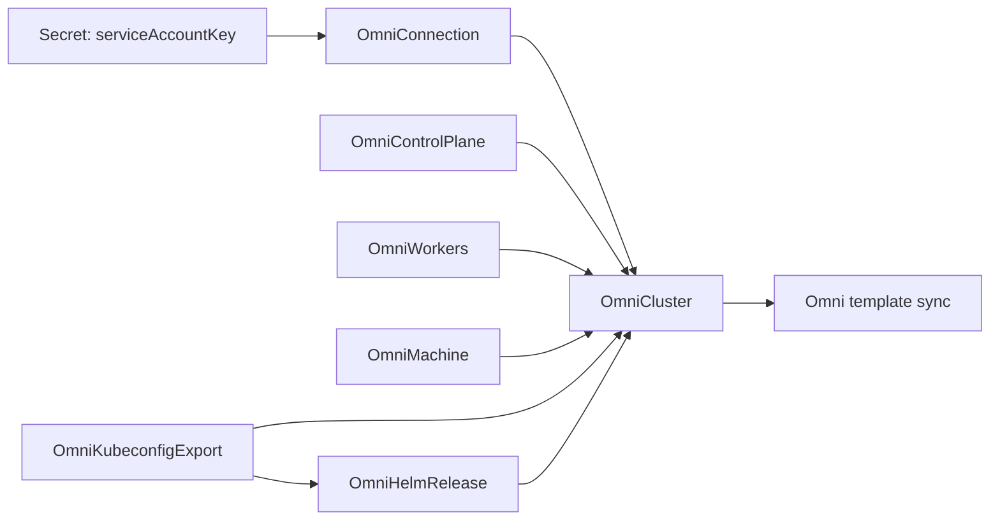

# Cluster Lifecycle

Use these resources to manage the full Omni cluster template lifecycle from Kubernetes:

- Create the Omni cluster template.
- Update Kubernetes, Talos, patches, machine assignments, worker sets, and managed manifests.
- Pause remote sync while preparing a larger change.
- Delete the remote Omni cluster or orphan it intentionally.

Create one `OmniConnection`, one `OmniCluster`, and exactly one `OmniControlPlane` for each cluster. Add `OmniWorkers` and `OmniMachine` only when the cluster needs them. Add `OmniKubeconfigExport` to create and export a workload-cluster kubeconfig Secret. Add `OmniHelmRelease` only after the exported kubeconfig Secret is available for direct Helm reconciliation.

If you do not create any workers, configure Talos to allow workloads on the control plane nodes.

These resources do not need to live in one multi-document YAML file. In a GitOps repository, it is usually clearer to keep them as separate manifests, for example:

```text
omni-cluster-operator/
  omni-connection.yaml
  clusters/
    cluster-01/
      cluster.yaml
      control-plane.yaml
      workers.yaml
      machines.yaml
      workload-access.yaml
      helm-releases.yaml
    cluster-02/
      cluster.yaml
      control-plane.yaml
      workers.yaml
      machines.yaml
```

The exact layout is up to you. The important part is that the `OmniConnection` can be shared by multiple `OmniCluster` resources when they use the same Omni endpoint and service account Secret.

The examples below use static Omni machine IDs. Replace the endpoint, versions, and machine IDs with values from your environment.

## Lifecycle model

`OmniCluster` is the resource with remote side effects. It selects the shared `OmniConnection`, gathers child resources by `spec.clusterRef.name`, renders one Omni cluster template, validates it with Omni's public client code, syncs it to Omni, and reports status back through Kubernetes conditions.

Child template resources do not talk to Omni directly. Updating an `OmniControlPlane`, `OmniWorkers`, or `OmniMachine` causes the parent `OmniCluster` to render and sync a new template. Cluster-level patches and raw managed manifests live on `OmniCluster` itself. `OmniHelmRelease` is different: it uses an explicit workload-cluster kubeconfig Secret and reconciles Helm directly after the workload cluster exists.



## Prepare credentials

Create the Secret before creating the `OmniConnection` that references it. The Secret must be in the operator release namespace.

Do not commit the real service account key to Git. Create the Secret with your secret-management workflow, or create it directly with `kubectl`:

```sh
kubectl create secret generic omni-service-account \
  --namespace omni-cluster-operator-system \
  --from-literal=serviceAccountKey='<omni service account key>'
```

## Define the connection

`OmniConnection` tells the operator how to reach Omni and which Secret key contains the service account key.

```yaml
apiVersion: omni.texashpc.com/v1alpha1
kind: OmniConnection
metadata:
  name: omni
  namespace: omni-cluster-operator-system
spec:
  endpoint: https://omni.example.com
  auth:
    serviceAccountSecretRef:
      name: omni-service-account
      key: serviceAccountKey
```

## Add machine-specific settings

Skip this section if the machine set definitions are enough for your cluster. Use `OmniMachine` resources only when you need per-machine settings such as install disk, patches, extensions, or kernel args.

`OmniMachine.spec.clusterRef.name` can point at the cluster name you are about to create. The resource may report `MissingCluster` until the matching `OmniCluster` exists.

```yaml
apiVersion: omni.texashpc.com/v1alpha1
kind: OmniMachine
metadata:
  name: cluster-01-control-plane-0
  namespace: omni-cluster-operator-system
spec:
  clusterRef:
    name: cluster-01
  machineID: 11111111-1111-4111-8111-111111111111
  install:
    disk: /dev/nvme0n1
```

## Add the control plane

Each cluster should have exactly one `OmniControlPlane`. It can select explicit machine IDs or a machine class.

```yaml
apiVersion: omni.texashpc.com/v1alpha1
kind: OmniControlPlane
metadata:
  name: cluster-01-control-plane
  namespace: omni-cluster-operator-system
spec:
  clusterRef:
    name: cluster-01
  machines:
    - 11111111-1111-4111-8111-111111111111
```

## Add workers

`OmniWorkers` defines one worker set. Add more `OmniWorkers` resources when a cluster needs multiple worker sets.

```yaml
apiVersion: omni.texashpc.com/v1alpha1
kind: OmniWorkers
metadata:
  name: cluster-01-workers
  namespace: omni-cluster-operator-system
spec:
  clusterRef:
    name: cluster-01
  machines:
    - 22222222-2222-4222-8222-222222222222
```

## Optional: add Omni-managed manifests

Use `OmniCluster.spec.kubernetes.manifests` when Omni should apply raw Kubernetes YAML through the cluster template. This is a good fit for small prerequisites such as namespaces, labels, or other manifest-sync resources that should be part of Omni template ownership.

```yaml
apiVersion: omni.texashpc.com/v1alpha1
kind: OmniCluster
metadata:
  name: cluster-01
  namespace: omni-cluster-operator-system
spec:
  connectionRef:
    name: omni
  kubernetes:
    version: v1.35.0
    manifests:
      - name: platform-namespace
        mode: full
        inline:
          - apiVersion: v1
            kind: Namespace
            metadata:
              name: platform
  talos:
    version: v1.13.2
```

Use `OmniHelmRelease` instead when you want Helm release history, upgrades, status, and uninstall behavior in the workload cluster.

## Optional: use machine classes

Skip this section when you want to assign explicit machine IDs. `OmniControlPlane` and `OmniWorkers` accept either `machines` or `machineClass`, but not both.

This control plane uses a machine class instead of explicit machine IDs:

```yaml
apiVersion: omni.texashpc.com/v1alpha1
kind: OmniControlPlane
metadata:
  name: cluster-01-control-plane
  namespace: omni-cluster-operator-system
spec:
  clusterRef:
    name: cluster-01
  machineClass:
    name: control-plane
    size: 3
```

This worker set also uses a machine class:

```yaml
apiVersion: omni.texashpc.com/v1alpha1
kind: OmniWorkers
metadata:
  name: cluster-01-gpu-workers
  namespace: omni-cluster-operator-system
spec:
  clusterRef:
    name: cluster-01
  workerSetName: gpu-workers
  machineClass:
    name: gpu
    size: 3
```

## Create the cluster

`OmniCluster` ties the template together. It owns the remote Omni cluster lifecycle, selects the shared connection, gathers child template resources by `clusterRef`, and defines cluster-level versions and settings.

```yaml
apiVersion: omni.texashpc.com/v1alpha1
kind: OmniCluster
metadata:
  name: cluster-01
  namespace: omni-cluster-operator-system
spec:
  connectionRef:
    name: omni
  kubernetes:
    version: v1.35.0
  talos:
    version: v1.13.2
  syncInterval: 5m
```

If the cluster has no `OmniWorkers`, the control plane nodes need to run normal workloads too. Talos does not schedule workloads on control plane nodes by default, so add a cluster-level patch that sets `cluster.allowSchedulingOnControlPlanes: true`:

```yaml
apiVersion: omni.texashpc.com/v1alpha1
kind: OmniCluster
metadata:
  name: cluster-01
  namespace: omni-cluster-operator-system
spec:
  connectionRef:
    name: omni
  kubernetes:
    version: v1.35.0
  talos:
    version: v1.13.2
  patches:
    - name: allow-control-plane-workloads
      inline:
        cluster:
          allowSchedulingOnControlPlanes: true
  syncInterval: 5m
```

Apply `OmniCluster` with `spec.suspend: true` if you want to create or update resources without syncing to Omni yet:

```yaml
spec:
  suspend: true
```

Remove the field or set it to `false` when the cluster template is ready to sync.

## Apply and check status

Apply the manifests with your normal Kubernetes or GitOps workflow. For example:

```sh
kubectl apply -f <manifest-file-or-directory>
```

Check status:

```sh
kubectl get omniconnections,omniclusters,omnicontrolplanes,omniworkers,omnimachines \
  --namespace omni-cluster-operator-system

kubectl describe omnicluster cluster-01 \
  --namespace omni-cluster-operator-system
```

`OmniCluster.status.renderedTemplateHash`, `status.lastSyncTime`, and conditions show whether the current Kubernetes resources were rendered and synced successfully.

## Access the workload cluster

After Omni creates the cluster and reports the Kubernetes API as available, get workload-cluster credentials from Omni. `omni-cluster-operator` does not automatically write a child-cluster kubeconfig Secret into the management cluster unless you create an explicit `OmniKubeconfigExport`.

For human access, download the kubeconfig from the Omni UI, or use `omnictl`:

```sh
omnictl kubeconfig --cluster <omni-cluster-name> --merge
```

This is the normal path for interactive `kubectl` access. Access is still governed by Omni authentication and access policy.

For declarative automation, create an `OmniKubeconfigExport` in the operator namespace:

```yaml
apiVersion: omni.texashpc.com/v1alpha1
kind: OmniKubeconfigExport
metadata:
  name: cluster-01-automation-kubeconfig
  namespace: omni-cluster-operator-system
spec:
  clusterRef:
    name: cluster-01
  targetSecretRef:
    name: cluster-01-automation-kubeconfig
  serviceAccount:
    user: cluster-01-automation
    groups:
      - cluster-automation
  ttl: 24h
  renewBefore: 4h
  deletionPolicy: Delete
```

The operator writes `data.kubeconfig` in the target Secret and rotates it before expiration when `renewBefore` is set. The `system:masters` group is rejected unless you also set `serviceAccount.allowClusterAdmin: true`.

See [Workload Cluster Access](workload-access.md) for rotation, Secret shape, deletion policy, and RBAC guidance.

For Talos access, download the cluster talosconfig from the Omni UI or use:

```sh
omnictl talosconfig --cluster <omni-cluster-name>
```

Treat talosconfig as privileged operational access.

## Update the cluster

Update the same resources you used to create the cluster. The operator treats edits as desired-state changes and reconciles the Omni template again.

Common updates include:

- Change `OmniCluster.spec.kubernetes.version` or `spec.talos.version`.
- Add, remove, or edit cluster-level `spec.patches`.
- Add or remove an `OmniWorkers` resource.
- Change worker set `spec.machineClass.size` or explicit `spec.machines`.
- Add or edit an `OmniMachine` for per-node install disk, patches, extensions, or kernel args.
- Add or edit `OmniCluster.spec.kubernetes.manifests` for raw Omni-managed Kubernetes manifests.
- Add or edit an `OmniHelmRelease` resource for direct Helm reconciliation using an explicit workload-cluster kubeconfig Secret.

Example version update:

```yaml
apiVersion: omni.texashpc.com/v1alpha1
kind: OmniCluster
metadata:
  name: cluster-01
  namespace: omni-cluster-operator-system
spec:
  connectionRef:
    name: omni
  kubernetes:
    version: v1.35.1
  talos:
    version: v1.13.3
  syncInterval: 5m
```

Example worker scale-out with a machine class:

```yaml
apiVersion: omni.texashpc.com/v1alpha1
kind: OmniWorkers
metadata:
  name: cluster-01-gpu-workers
  namespace: omni-cluster-operator-system
spec:
  clusterRef:
    name: cluster-01
  workerSetName: gpu-workers
  machineClass:
    name: gpu
    size: 4
```

If you need to stage several resources before Omni sees them, set `spec.suspend: true` on `OmniCluster`, apply the full change set, then resume sync.

## Pause remote sync

Set `spec.suspend: true` on `OmniCluster` to stop remote Omni sync while preserving Kubernetes resources, status, and finalizers.

```sh
kubectl patch omnicluster cluster-01 \
  --namespace omni-cluster-operator-system \
  --type merge \
  --patch '{"spec":{"suspend":true}}'
```

Resume sync:

```sh
kubectl patch omnicluster cluster-01 \
  --namespace omni-cluster-operator-system \
  --type merge \
  --patch '{"spec":{"suspend":false}}'
```

## Delete the cluster

Deleting `OmniCluster` is the destructive lifecycle operation. By default, the operator finalizer calls Omni template deletion before removing the Kubernetes finalizer.

Delete the cluster resources with your normal Kubernetes or GitOps workflow:

```sh
kubectl delete omnicluster cluster-01 \
  --namespace omni-cluster-operator-system
```

After the parent cluster is gone, delete child resources that only belonged to that cluster:

```sh
kubectl delete omnicontrolplane cluster-01-control-plane \
  --namespace omni-cluster-operator-system

kubectl delete omniworkers cluster-01-workers \
  --namespace omni-cluster-operator-system

kubectl delete omnimachine cluster-01-control-plane-0 \
  --namespace omni-cluster-operator-system
```

Set `spec.deletePolicy.orphan: true` before deletion when you want Kubernetes to stop managing the cluster but leave the remote Omni cluster and template-managed resources in place:

```sh
kubectl patch omnicluster cluster-01 \
  --namespace omni-cluster-operator-system \
  --type merge \
  --patch '{"spec":{"deletePolicy":{"orphan":true}}}'
```

Set `spec.deletePolicy.destroyMachines: true` only when Omni deletion should forcefully remove disconnected nodes while deleting template resources:

```sh
kubectl patch omnicluster cluster-01 \
  --namespace omni-cluster-operator-system \
  --type merge \
  --patch '{"spec":{"deletePolicy":{"destroyMachines":true}}}'
```

`orphan` and `destroyMachines` are mutually exclusive.
