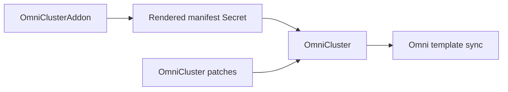

# Manage Cilium

Use `OmniClusterAddon` for new Cilium installs. It renders the Cilium Helm chart into an Omni manifest entry, while `OmniCluster.spec.patches` carries the Talos networking settings Cilium needs.

`OmniCilium` remains supported as a legacy compatibility resource, but new examples use the generic addon model. That keeps the operator's trust boundary the same: Helm is only a renderer, Omni still applies the manifest, and the operator does not connect to the workload cluster as a Helm release controller.

## How it fits



Create at most one Cilium addon for each `OmniCluster` unless you deliberately use different `manifestName` values for staged migration work.

## Talos patches

Cilium on Talos normally needs the built-in CNI disabled:

```yaml
spec:
  patches:
    - name: disable-default-cni-for-cilium
      inline:
        cluster:
          network:
            cni:
              name: none
```

If Cilium replaces kube-proxy, also disable Talos kube-proxy:

```yaml
spec:
  patches:
    - name: disable-default-cni-for-cilium
      inline:
        cluster:
          network:
            cni:
              name: none
          proxy:
            disabled: true
```

## Create Cilium

This example renders Cilium `1.19.3`, enables kube-proxy replacement, and enables Gateway API support:

```yaml
apiVersion: omni.texashpc.com/v1alpha1
kind: OmniCluster
metadata:
  name: cluster-01
  namespace: omni-cluster-operator-system
spec:
  connectionRef:
    name: omni
  kubernetes:
    version: v1.35.0
  talos:
    version: v1.13.2
  patches:
    - name: disable-default-cni-for-cilium
      inline:
        cluster:
          network:
            cni:
              name: none
          proxy:
            disabled: true
---
apiVersion: omni.texashpc.com/v1alpha1
kind: OmniClusterAddon
metadata:
  name: cluster-01-cilium
  namespace: omni-cluster-operator-system
spec:
  clusterRef:
    name: cluster-01
  manifestName: cilium
  mode: full
  helm:
    repository: https://helm.cilium.io/
    chart: cilium
    version: 1.19.3
    releaseName: cilium
    namespace: kube-system
    values:
      ipam:
        mode: kubernetes
      kubeProxyReplacement: true
      k8sServiceHost: localhost
      k8sServicePort: 7445
      cgroup:
        autoMount:
          enabled: false
        hostRoot: /sys/fs/cgroup
      securityContext:
        capabilities:
          ciliumAgent:
            - CHOWN
            - KILL
            - NET_ADMIN
            - NET_RAW
            - IPC_LOCK
            - SYS_ADMIN
            - SYS_RESOURCE
            - DAC_OVERRIDE
            - FOWNER
            - SETGID
            - SETUID
          cleanCiliumState:
            - NET_ADMIN
            - SYS_ADMIN
            - SYS_RESOURCE
      gatewayAPI:
        enabled: true
        enableAlpn: true
        enableAppProtocol: true
```

Apply it with the rest of the cluster manifests:

```sh
kubectl apply -f <manifest-file-or-directory>
```

## Update Cilium

Update `OmniClusterAddon.spec.helm.version`, `spec.helm.values`, or related fields in Git or with `kubectl apply`. The addon controller renders a new manifest when the spec hash changes, stores it in the rendered manifest Secret, and updates status with the new manifest hash.

The parent `OmniCluster` waits until the rendered Secret is current before syncing the cluster template. This avoids sending a partial template to Omni while the Cilium render is still pending or failed.

## Avoid duplicate manifest names

The rendered Cilium manifest is added to `OmniCluster.spec.kubernetes.manifests` using `spec.manifestName`, which is `cilium` in the examples above.

Do not create another `OmniCluster.spec.kubernetes.manifests[]`, `OmniClusterAddon`, or legacy `OmniCilium` entry with the same manifest name.

## Delete or hand off Cilium

Deleting the Cilium `OmniClusterAddon` removes this operator's addon resource. The rendered manifest Secret is owned by the addon and is garbage-collected by Kubernetes.

The parent `OmniCluster` then renders without the Cilium manifest entry. If you also remove the Talos Cilium patches, the remote effect is an Omni template update, not a direct Helm uninstall command from this operator.

Plan deletion based on the mode you used:

- With `mode: full`, removing the manifest from the template hands object removal to Omni's full manifest sync semantics for the `cilium` manifest group.
- With `mode: one-time`, deleting the addon usually means the operator stops expressing Cilium in the template. It should not be treated as a guaranteed workload-cluster uninstall path.
- If you want to keep Cilium running but move management elsewhere, first switch ownership deliberately, then remove the addon after the new owner is ready.

For a destructive Cilium uninstall, use an explicit workload-cluster procedure appropriate for your environment. Do not rely on deleting the addon as the only uninstall step unless you have verified Omni's manifest behavior for your cluster.

## Migrate from OmniCilium

`OmniCilium` bundled two behaviors: it rendered the Cilium chart with Talos-compatible defaults, and it injected Talos patches into the parent cluster template. `OmniClusterAddon` only handles the generic render-and-cache behavior.

To migrate:

1. Add the Cilium Talos patch to `OmniCluster.spec.patches`.
2. Create an `OmniClusterAddon` with `manifestName: cilium`, the same chart version, and equivalent Helm values.
3. Confirm the addon reports `Ready=True` and the parent `OmniCluster` syncs successfully.
4. Remove the legacy `OmniCilium` resource from Git or delete it.

Do not run `OmniCilium` and the replacement `OmniClusterAddon` with the same manifest name at the same time; the parent cluster rejects duplicate manifest names.

## Switch CNIs

Switching from Cilium to another CNI, or from another CNI to Cilium, is a staged network migration. Use `OmniCluster.spec.suspend: true` while changing CNI ownership and Talos proxy behavior, then resume sync only after the final desired state is complete.

Verify node readiness, CNI pods, CoreDNS, service routing, and workload networking before removing any old CNI objects that remain in the workload cluster.
