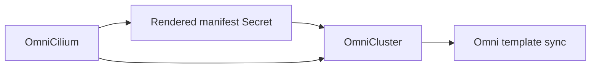

# Manage Cilium

Use `OmniCilium` when a cluster should get Cilium through the Omni cluster template and continue expressing that Cilium configuration from Kubernetes.

Omni applies raw Kubernetes manifests after the workload cluster API is available. It does not run Helm inside Omni. `OmniCilium` fills that gap by rendering the Cilium Helm chart in the operator, caching the rendered YAML in a Secret, and adding that rendered manifest to the `OmniCluster` template.

`OmniCilium` is not a Helm release controller. It renders Helm output into an Omni manifest entry. From there, Omni applies that manifest according to the manifest `mode`.

## How it fits

`OmniCilium` is an optional child resource of `OmniCluster`.



Create at most one `OmniCilium` for each `OmniCluster`. The resource can reference the cluster name before the `OmniCluster` exists, but it may report `MissingCluster` until the matching cluster is created.

## One-time or ongoing management

`spec.mode` controls how Omni applies the rendered Cilium manifest:

| Mode | Use when | Behavior |
| --- | --- | --- |
| `full` | Cilium should remain managed through the Omni cluster template. | The rendered Cilium manifest stays in the template and Omni continues reconciling it according to Omni manifest sync behavior. This is the default. |
| `one-time` | Cilium should be bootstrapped by Omni, then managed elsewhere or left alone. | The operator still renders and injects the manifest, but the Omni manifest entry is marked `one-time`. Use this when you do not want ongoing manifest management through Omni. |

Keep `full` unless you have a specific handoff plan. With `full`, changes to the `OmniCilium` spec produce a new cached manifest, and the parent `OmniCluster` syncs that updated manifest to Omni.

## Create an OmniCilium

This example renders Cilium `1.19.3`, enables kube-proxy replacement, and enables Gateway API support:

```yaml
apiVersion: omni.texashpc.com/v1alpha1
kind: OmniCilium
metadata:
  name: cluster-01-cilium
  namespace: omni-cluster-operator-system
spec:
  clusterRef:
    name: cluster-01
  chartVersion: 1.19.3
  values:
    kubeProxyReplacement: true
    gatewayAPI:
      enabled: true
      enableAlpn: true
      enableAppProtocol: true
```

Apply it with the rest of the cluster manifests:

```sh
kubectl apply -f <manifest-file-or-directory>
```

## What the operator adds

The operator renders the Helm chart with Talos-compatible defaults, then caches the rendered output in a Secret named from the `OmniCilium` resource:

```text
<omnicilium-name>-cilium-manifest
```

For the example above, the Secret is:

```text
cluster-01-cilium-cilium-manifest
```

The `OmniCluster` controller waits for that cached manifest to be current, parses it, and adds it to the Omni template as a Kubernetes manifest entry.

The operator also injects the Talos machine configuration patch Cilium needs:

```yaml
cluster:
  network:
    cni:
      name: none
```

When `spec.values.kubeProxyReplacement` is `true`, the operator also disables kube-proxy in Talos:

```yaml
cluster:
  proxy:
    disabled: true
```

## Defaults

| Field | Default |
| --- | --- |
| `spec.chartRepository` | `https://helm.cilium.io/` |
| `spec.releaseName` | `cilium` |
| `spec.namespace` | `kube-system` |
| `spec.manifestName` | `cilium` |
| `spec.mode` | `full` |

`spec.values` is merged over the operator's Talos-compatible Cilium defaults. Set only the Cilium Helm values you need to override.

## Update Cilium

Update `OmniCilium.spec.chartVersion`, `spec.values`, or related fields in Git or with `kubectl apply`. The `OmniCilium` controller renders a new manifest when the spec hash changes, stores it in the rendered manifest Secret, and updates status with the new manifest hash.

The parent `OmniCluster` waits until the rendered Secret is current before syncing the cluster template. This avoids sending a partial template to Omni while the Cilium render is still pending or failed.

Example chart update:

```yaml
apiVersion: omni.texashpc.com/v1alpha1
kind: OmniCilium
metadata:
  name: cluster-01-cilium
  namespace: omni-cluster-operator-system
spec:
  clusterRef:
    name: cluster-01
  chartVersion: 1.19.4
  mode: full
  values:
    kubeProxyReplacement: true
    gatewayAPI:
      enabled: true
      enableAlpn: true
      enableAppProtocol: true
```

## Avoid duplicate manifest names

The rendered Cilium manifest is added to `OmniCluster.spec.kubernetes.manifests` using `spec.manifestName`, which defaults to `cilium`.

Do not create another `OmniCluster.spec.kubernetes.manifests[]` entry with the same name. If you need to use a different name, set `spec.manifestName` on `OmniCilium`.

## Delete or hand off Cilium

Deleting `OmniCilium` removes this operator's Cilium child resource. The rendered manifest Secret is owned by the `OmniCilium` object and is garbage-collected by Kubernetes.

The parent `OmniCluster` then renders without the Cilium manifest entry and without the Cilium-specific Talos patches. The remote effect is an Omni template update, not a direct Helm uninstall command from this operator.

Plan deletion based on the mode you used:

- With `mode: full`, removing the manifest from the template hands the removal behavior to Omni's full manifest sync semantics.
- With `mode: one-time`, deleting `OmniCilium` usually means the operator stops expressing Cilium in the template. It should not be treated as a guaranteed workload-cluster uninstall path.
- If you want to keep Cilium running but move management elsewhere, first switch ownership deliberately, then remove `OmniCilium` after the new owner is ready.

For a destructive Cilium uninstall, use an explicit workload-cluster procedure appropriate for your environment. Do not rely on deleting `OmniCilium` as the only uninstall step unless you have verified Omni's manifest behavior for your cluster.

## Switch from Cilium to another CNI

Switching away from Cilium has two parts:

1. Stop this operator from expressing Cilium in the Omni template.
2. Add the replacement CNI and the Talos networking settings it needs.

`OmniCilium` adds these Talos settings while it is attached to the cluster:

```yaml
cluster:
  network:
    cni:
      name: none
```

If Cilium kube-proxy replacement is enabled, it also adds:

```yaml
cluster:
  proxy:
    disabled: true
```

When moving to Flannel, Calico, or another CNI, make sure the final `OmniCluster` template no longer depends on those Cilium-specific assumptions unless the replacement CNI explicitly requires them.

Use a staged migration:

1. Set `OmniCluster.spec.suspend: true`.
2. Add the replacement CNI manifests or Talos CNI settings to `OmniCluster`.
3. If kube-proxy should run again, remove Cilium kube-proxy replacement from the final desired state and configure Talos proxy behavior for the new CNI.
4. Remove `OmniCilium` from Git or delete it from the cluster.
5. Resume `OmniCluster` sync.
6. Verify node readiness, CNI pods, CoreDNS, service routing, and workload networking before removing any old Cilium objects that remain in the workload cluster.

The exact uninstall sequence for Cilium depends on how Omni applied the manifest and what Cilium features were enabled. Treat Cilium removal as a workload-cluster network migration, not just deletion of this custom resource.

Example final state for handing Cilium off to another manifest entry:

```yaml
apiVersion: omni.texashpc.com/v1alpha1
kind: OmniCluster
metadata:
  name: cluster-01
  namespace: omni-cluster-operator-system
spec:
  connectionRef:
    name: omni
  kubernetes:
    version: v1.35.0
    manifests:
      - name: replacement-cni
        mode: full
        inline:
          - apiVersion: v1
            kind: Namespace
            metadata:
              name: replacement-cni-system
  talos:
    version: v1.13.2
```

The manifest above is only a shape example. Use the replacement CNI's real manifest and Talos requirements.

## Move from another CNI to Cilium

Moving from Flannel, Calico, or another CNI to `OmniCilium` is also a staged network migration. The operator can render and inject Cilium, but it does not remove the old CNI or prove that two CNIs can coexist during the transition.

Plan the migration around these implications:

- `OmniCilium` sets Talos `cluster.network.cni.name: none`, so Talos will not install a built-in/default CNI for the cluster template.
- If `spec.values.kubeProxyReplacement` is `true`, the operator disables Talos kube-proxy. Leave kube-proxy replacement disabled unless you have planned the kube-proxy handoff.
- The old CNI's DaemonSets, CRDs, webhooks, IPAM state, node annotations, routes, and NetworkPolicy behavior may need explicit cleanup or conversion.
- Network policy semantics can change between providers. Validate policies before relying on an in-place migration.
- Expect a maintenance window unless you have tested the exact old-CNI-to-Cilium path for your cluster shape.

Use a staged migration:

1. Set `OmniCluster.spec.suspend: true`.
2. Add `OmniCilium` with the intended `chartVersion`, `mode`, and Helm values.
3. Decide whether Cilium should replace kube-proxy now. If not, keep `kubeProxyReplacement` disabled.
4. Remove or disable the old CNI from the desired state according to that CNI's migration guidance.
5. Resume `OmniCluster` sync.
6. Verify the `OmniCilium` rendered manifest Secret, the parent `OmniCluster` sync status, node readiness, Cilium pods, CoreDNS, service routing, and workload networking.
7. Complete old-CNI cleanup only after Cilium is the active dataplane.

Example starting point:

```yaml
apiVersion: omni.texashpc.com/v1alpha1
kind: OmniCilium
metadata:
  name: cluster-01-cilium
  namespace: omni-cluster-operator-system
spec:
  clusterRef:
    name: cluster-01
  chartVersion: 1.19.3
  mode: full
  values:
    kubeProxyReplacement: false
```

Enable kube-proxy replacement later as a separate change if you want a smaller migration blast radius.

## Check status

Check both the Cilium child resource and the parent cluster:

```sh
kubectl get omniciliums,omniclusters \
  --namespace omni-cluster-operator-system

kubectl describe omnicilium cluster-01-cilium \
  --namespace omni-cluster-operator-system

kubectl describe omnicluster cluster-01 \
  --namespace omni-cluster-operator-system
```

Useful `OmniCilium` status fields:

| Field | Meaning |
| --- | --- |
| `status.renderedManifestSecretRef` | Secret containing the cached rendered Cilium YAML. |
| `status.renderedManifestHash` | SHA-256 hash of the cached manifest. |
| `status.kubeProxyReplacement` | Whether rendered values request Cilium kube-proxy replacement. |
| `status.manifestName` | Omni manifest entry name used in the cluster template. |

If the Cilium render is still pending, the parent `OmniCluster` waits and retries instead of syncing a partial template.
