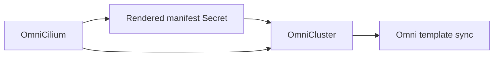

# Install Cilium

Use `OmniCilium` when a cluster should get Cilium through the Omni cluster template.

Omni applies raw Kubernetes manifests after the workload cluster API is available. It does not run Helm inside Omni. `OmniCilium` fills that gap by rendering the Cilium Helm chart in the operator, caching the rendered YAML in a Secret, and adding that rendered manifest to the `OmniCluster` template.

## How it fits

`OmniCilium` is an optional child resource of `OmniCluster`.



Create at most one `OmniCilium` for each `OmniCluster`. The resource can reference the cluster name before the `OmniCluster` exists, but it may report `MissingCluster` until the matching cluster is created.

## Create an OmniCilium

This example renders Cilium `1.19.3`, enables kube-proxy replacement, and enables Gateway API support:

```yaml
apiVersion: omni.texas-hpc.org/v1alpha1
kind: OmniCilium
metadata:
  name: cluster-01-cilium
  namespace: omni-cluster-operator-system
spec:
  clusterRef:
    name: cluster-01
  chartVersion: 1.19.3
  values:
    kubeProxyReplacement: true
    gatewayAPI:
      enabled: true
      enableAlpn: true
      enableAppProtocol: true
```

Apply it with the rest of the cluster manifests:

```sh
kubectl apply -f <manifest-file-or-directory>
```

## What the operator adds

The operator renders the Helm chart with Talos-compatible defaults, then caches the rendered output in a Secret named from the `OmniCilium` resource:

```text
<omnicilium-name>-cilium-manifest
```

For the example above, the Secret is:

```text
cluster-01-cilium-cilium-manifest
```

The `OmniCluster` controller waits for that cached manifest to be current, parses it, and adds it to the Omni template as a Kubernetes manifest entry.

The operator also injects the Talos machine configuration patch Cilium needs:

```yaml
cluster:
  network:
    cni:
      name: none
```

When `spec.values.kubeProxyReplacement` is `true`, the operator also disables kube-proxy in Talos:

```yaml
cluster:
  proxy:
    disabled: true
```

## Defaults

| Field | Default |
| --- | --- |
| `spec.chartRepository` | `https://helm.cilium.io/` |
| `spec.releaseName` | `cilium` |
| `spec.namespace` | `kube-system` |
| `spec.manifestName` | `cilium` |
| `spec.mode` | `full` |

`spec.values` is merged over the operator's Talos-compatible Cilium defaults. Set only the Cilium Helm values you need to override.

## Avoid duplicate manifest names

The rendered Cilium manifest is added to `OmniCluster.spec.kubernetes.manifests` using `spec.manifestName`, which defaults to `cilium`.

Do not create another `OmniCluster.spec.kubernetes.manifests[]` entry with the same name. If you need to use a different name, set `spec.manifestName` on `OmniCilium`.

## Check status

Check both the Cilium child resource and the parent cluster:

```sh
kubectl get omniciliums,omniclusters \
  --namespace omni-cluster-operator-system

kubectl describe omnicilium cluster-01-cilium \
  --namespace omni-cluster-operator-system

kubectl describe omnicluster cluster-01 \
  --namespace omni-cluster-operator-system
```

Useful `OmniCilium` status fields:

| Field | Meaning |
| --- | --- |
| `status.renderedManifestSecretRef` | Secret containing the cached rendered Cilium YAML. |
| `status.renderedManifestHash` | SHA-256 hash of the cached manifest. |
| `status.kubeProxyReplacement` | Whether rendered values request Cilium kube-proxy replacement. |
| `status.manifestName` | Omni manifest entry name used in the cluster template. |

If the Cilium render is still pending, the parent `OmniCluster` waits and retries instead of syncing a partial template.
