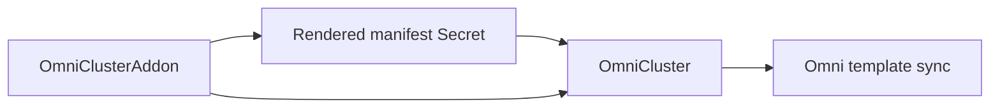

# Manage Addons

Use `OmniClusterAddon` when a workload-cluster application is distributed as a Helm chart, but you want Omni to apply the resulting Kubernetes objects through the cluster template.

The operator uses Helm as a renderer only. It does not connect to the workload cluster, create a Helm release, run upgrade hooks, or uninstall remote objects. It renders the chart, caches the YAML in a Kubernetes Secret, and has the parent `OmniCluster` inject that rendered manifest into the Omni template.

## How it fits

`OmniClusterAddon` is an optional child resource of `OmniCluster`.



Create one `OmniClusterAddon` for each Helm-rendered manifest entry. Multiple addons can reference the same `OmniCluster` as long as their rendered Omni manifest names are unique.

## Create an addon

This example renders the `metrics-server` chart and asks Omni to keep the rendered objects managed through manifest sync:

```yaml
apiVersion: omni.texashpc.com/v1alpha1
kind: OmniClusterAddon
metadata:
  name: cluster-01-metrics-server
  namespace: omni-cluster-operator-system
spec:
  clusterRef:
    name: cluster-01
  manifestName: metrics-server
  mode: full
  helm:
    repository: https://kubernetes-sigs.github.io/metrics-server/
    chart: metrics-server
    version: 3.13.0
    releaseName: metrics-server
    namespace: kube-system
    values:
      replicas: 2
```

The controller renders the chart and stores it in a Secret named:

```text
<omniclusteraddon-name>-addon-manifest
```

The parent `OmniCluster` waits until the cached Secret is current before syncing the cluster template.

## One-time or ongoing management

`spec.mode` controls how Omni applies the rendered manifest:

| Mode | Use when | Behavior |
| --- | --- | --- |
| `full` | Omni should keep reconciling the rendered objects. | The addon stays in the cluster template and Omni continues manifest sync. This is the default. |
| `one-time` | Omni should bootstrap the objects once, then leave them alone or hand them off. | The rendered manifest is still injected into the template, but the Omni manifest entry is marked `one-time`. |

Use `full` unless you have a specific handoff plan.

## Defaults

| Field | Default |
| --- | --- |
| `spec.manifestName` | `metadata.name` |
| `spec.mode` | `full` |
| `spec.helm.releaseName` | `metadata.name` |
| `spec.helm.namespace` | `default` |

`spec.helm.values` must be a JSON/YAML object and is passed directly to Helm.

## Operational notes

- `OmniClusterAddon` is render-to-template only. It is not a remote Helm release reconciler.
- Do not create another `OmniCluster.spec.kubernetes.manifests[]`, `OmniClusterAddon`, or legacy `OmniCilium` entry with the same rendered manifest name.
- If a chart requires Talos machine configuration changes, express those explicitly in `OmniCluster.spec.patches`. Generic addons do not add Cilium-specific or chart-specific Talos patches.

## Delete or render no objects

Deleting an addon removes this operator's addon resource and lets Kubernetes garbage-collect its rendered manifest Secret. The parent `OmniCluster` then syncs a template without that addon manifest group. This operator does not run `helm uninstall` and does not directly contact the workload cluster.

If a chart update renders no Kubernetes objects, the addon stays in the template with an empty inline manifest so Omni can observe the new desired state for that manifest group.

Plan deletion based on `spec.mode`:

| Mode | Deletion behavior |
| --- | --- |
| `full` | Removing the addon, or rendering an empty manifest, hands object removal to Omni's full manifest sync semantics for that manifest group. |
| `one-time` | Omni treats the manifest as bootstrap/handoff state. Do not use addon deletion or an empty render as a guaranteed workload-cluster uninstall path. |

For destructive uninstalls, use the chart or application procedure appropriate for the workload cluster and verify the result there.

For Cilium-specific Talos settings and migration guidance, see [Manage Cilium](install-cilium.md).
