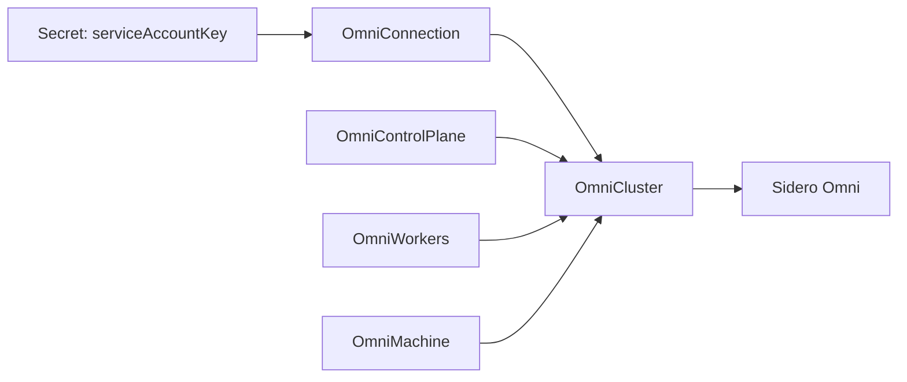

# omni-cluster-operator

`omni-cluster-operator` lets platform teams manage Sidero Omni cluster templates with normal Kubernetes custom resources.

The operator runs in a Kubernetes namespace, reads an `OmniConnection`, assembles one `OmniCluster` plus its child template documents, validates the rendered Omni cluster-template YAML with Omni's public Go client, syncs it to Omni, and reports status back through Kubernetes conditions.

Use it when you want:

- GitOps-friendly Omni cluster lifecycle configuration.
- Omni service account keys stored in Kubernetes Secrets.
- Separate Kubernetes resources for cluster settings, control plane, workers, and static machines.
- Finalizer-based remote cleanup, with an orphan mode when you want to keep the Omni cluster after deleting Kubernetes resources.

## Start here

1. [Install the operator](getting-started/installation.md).
2. [Create a cluster template](getting-started/create-a-cluster.md).
3. [Check status and debug reconciliation](guides/debugging.md).
4. Use the [API reference](reference/api.md) when writing GitOps manifests.

## Important model

`OmniCluster` is the resource with remote side effects. It references an `OmniConnection`; child resources reference the cluster with `spec.clusterRef.name`.

All of these objects must live in the operator release namespace because the default deployment runs in namespaced mode.
