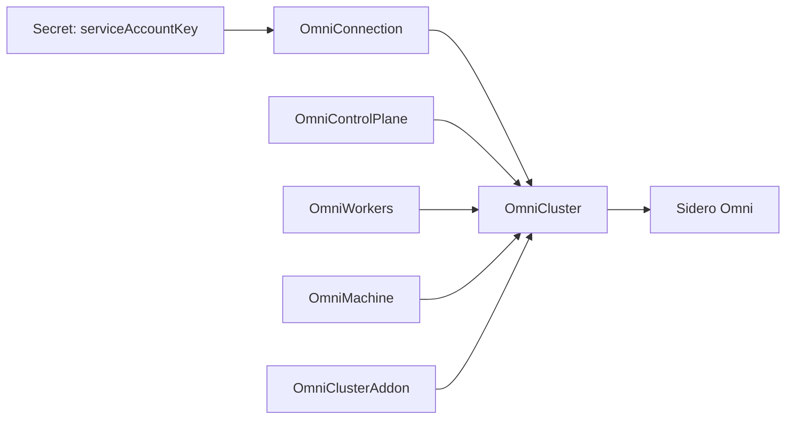

# omni-cluster-operator

`omni-cluster-operator` lets platform teams manage Sidero Omni cluster templates with normal Kubernetes custom resources, without replacing Omni.

!!! warning "Independent Community Project"
    `omni-cluster-operator` is not affiliated with, sponsored by, endorsed by, or maintained by Sidero Labs. Sidero, Omni, Talos, and related names are trademarks or projects of their respective owners.

The operator runs in a Kubernetes namespace, reads an `OmniConnection`, assembles one `OmniCluster` plus its child template documents, validates the rendered Omni cluster-template YAML with Omni's public Go client, syncs it to Omni, and reports status back through Kubernetes conditions while keeping Omni as the lifecycle authority.

Use it when you want:

- GitOps-friendly Omni cluster lifecycle configuration.
- Omni service account keys stored in Kubernetes Secrets.
- Separate Kubernetes resources for cluster settings, control plane, workers, and static machines.
- Optional Helm-rendered addons, including Cilium, while Omni applies raw manifests.
- Finalizer-based remote cleanup, with an orphan mode when you want to keep the Omni cluster after deleting Kubernetes resources.

## Which operator should I use?

Use `omni-cluster-operator` when Omni is part of your management plane and you want Kubernetes resources to render, validate, sync, and delete Omni cluster templates.

If you want to manage Talos Linux clusters directly without Omni, consider [`talos-operator`](https://alperencelik.github.io/talos-operator/) instead. It provides Kubernetes custom resources for Talos cluster lifecycle management, including direct Talos configuration, upgrades, backups, and generated access secrets. See [Choosing an Operator](concepts/choosing-an-operator.md) for a more detailed comparison.

## Start here

1. [Install the operator](getting-started/installation.md).
2. [Choose the right operator](concepts/choosing-an-operator.md), if you are comparing Omni-backed and direct Talos lifecycle management.
3. [Manage a cluster lifecycle](getting-started/create-a-cluster.md).
4. [Manage addons](getting-started/manage-addons.md), if Helm-rendered applications should be applied through Omni manifest sync.
5. [Manage Cilium](getting-started/install-cilium.md), if the cluster should receive Cilium through Omni manifest sync.
6. [Configure NVIDIA GPU workers](getting-started/nvidia-gpu.md), if the cluster should run GPU workloads.
7. [Plan GitOps ordering and deletion behavior](getting-started/gitops.md).
8. [Check status and debug reconciliation](guides/debugging.md).
9. Use the [API reference](reference/api.md) when writing manifests.

## Important model

`OmniCluster` is the resource with remote side effects. It references an `OmniConnection`; child resources reference the cluster with `spec.clusterRef.name`.

All of these objects must live in the operator release namespace because the default deployment runs in namespaced mode.
